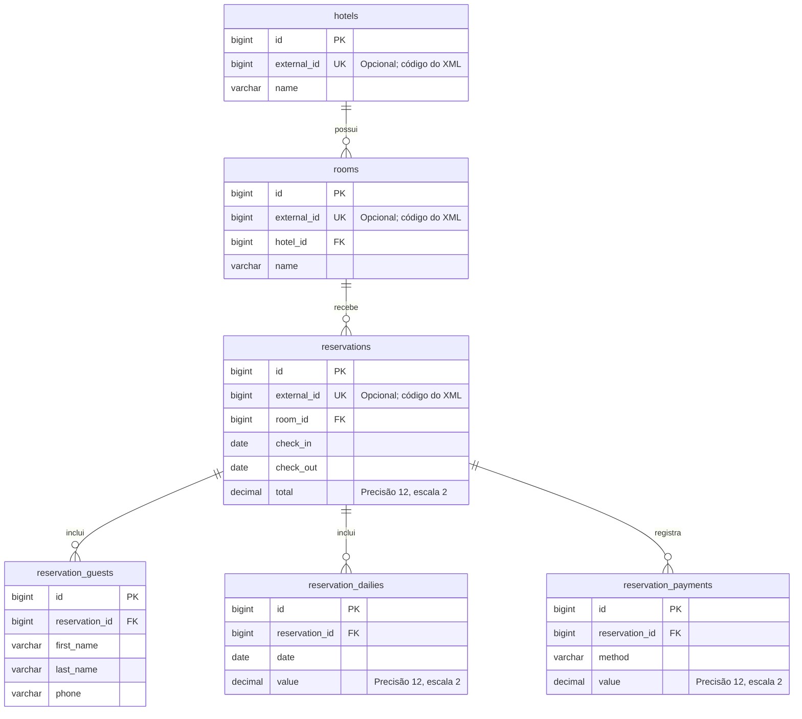

# Foco Hotel API

[](https://github.com/mrfiliperoberto/foco-hotel-desafio-api/actions/workflows/tests.yml)

API REST para gerenciamento de quartos e criação de reservas, com importação de dados de hotéis a partir de XML.

Desenvolvida em PHP e Laravel para o desafio técnico da Foco Multimídia.

## Tecnologias

- PHP e Laravel 13.
- MySQL 8.0.
- Eloquent ORM.
- Docker e Docker Compose para a aplicação e o banco.
- PHPUnit para testes automatizados.
- Laravel Pint para padronização do código PHP.
- Laravel Scheduler para agendamento da importação.
- OpenAPI 3.0.0 para documentação da API.
- GitHub Actions para execução dos testes e verificação de formatação.

O projeto foi desenvolvido com PHP 8.5.9 e Laravel Framework 13.34.0.

Existem duas opções de execução:

1. Aplicação e MySQL em contêineres Docker.
2. PHP e Composer na máquina, com MySQL em Docker.

Escolha uma das opções abaixo.

## Funcionalidades

- Importação de hotéis, quartos, reservas, hóspedes, diárias e pagamentos.
- Reimportação sem duplicação das entidades principais.
- CRUD de quartos.
- Criação de reservas com verificação de disponibilidade.
- Validação de datas e valores.
- Respostas da API em JSON.
- Proteção contra exclusão de quartos com reservas.
- Agendamento de importação a cada hora.
- Registro de inconsistências da importação em logs.

## Obter o projeto

```bash
git clone https://github.com/mrfiliperoberto/foco-hotel-desafio-api.git
cd foco-hotel-desafio-api
```

Execute os comandos das próximas seções na raiz do projeto.

## Opção 1 — Execução completa com Docker

### Requisitos

- Git.
- Docker com suporte a contêineres Linux.
- Docker Compose.

PHP e Composer são instalados na imagem, sem necessidade de instalação na máquina.

### Preparar o ambiente

Copie `.env.example` para `.env`.

Windows PowerShell:

```powershell
Copy-Item .env.example .env
```

Linux:

```bash
cp .env.example .env
```

Se já existir um `.env` configurado, mantenha-o.

O arquivo `.env` não deve ser versionado.

### Construir a imagem

```bash
docker compose build app
```

A imagem instala as dependências do Composer e verifica as extensões PHP necessárias.

### Configurar a chave da aplicação

Se `APP_KEY` estiver vazio no `.env`, execute:

```bash
docker compose run --rm --no-deps app php artisan key:generate --show
```

Copie a chave exibida para a linha `APP_KEY=` do `.env` da máquina e salve o arquivo.

Esse comando apenas exibe a chave. Ele não atualiza o `.env` da máquina automaticamente.

Caso o arquivo já contenha uma chave, preserve-a.

### Iniciar os serviços

```bash
docker compose up -d
docker compose ps
```

O serviço `app` aguarda o MySQL passar pela verificação de saúde.

Portas utilizadas:

| Serviço | Endereço na máquina | Porta interna |
|---|---|---|
| API | `127.0.0.1:8001` | `8000` |
| MySQL | `127.0.0.1:3307` | `3306` |

Dentro da rede Docker, a aplicação acessa o banco utilizando:

```ini
DB_HOST=mysql
DB_PORT=3306
```

Esses valores são fornecidos pelo Compose e prevalecem sobre os valores correspondentes do `.env`.

As credenciais configuradas no Compose são destinadas ao desenvolvimento local.

Se um servidor `php artisan serve` estiver utilizando a porta 8001, interrompa-o antes de iniciar o serviço `app`.

### Preparar o banco

```bash
docker compose exec app php artisan migrate
docker compose exec app php artisan hotel-data:import
```

A importação pode ser repetida sem duplicar os registros.

O aviso sobre a diária da reserva 6 é esperado e está explicado na seção de importação XML.

### Acessar a API

Endereço base:

```text
http://127.0.0.1:8001/api
```

Exemplo no PowerShell:

```powershell
Invoke-RestMethod -Uri "http://127.0.0.1:8001/api/rooms"
```

Exemplo com curl:

```bash
curl -H "Accept: application/json" http://127.0.0.1:8001/api/rooms
```

### Comandos úteis

Consultar migrations:

```bash
docker compose exec app php artisan migrate:status
```

Consultar rotas:

```bash
docker compose exec app php artisan route:list --path=api
```

Consultar logs dos serviços:

```bash
docker compose logs --tail 30 app
docker compose logs --tail 30 mysql
```

Encerrar os serviços:

```bash
docker compose down
```

O banco é persistido no volume `mysql_data`. O comando acima mantém esse volume.

### Alterações no código

O código é copiado para a imagem durante a construção. Após modificar arquivos da aplicação, reconstrua e recrie o serviço:

```bash
docker compose up -d --build app
```

Alterações no `.env` também exigem recriar o serviço para atualizar as variáveis fornecidas pelo Compose:

```bash
docker compose up -d --force-recreate app
```

A imagem utiliza o servidor de desenvolvimento do Laravel para execução e avaliação local.

O Compose não inicia o agendador automaticamente. Configure o CRON ou execute `schedule:work`, conforme a seção de agendamento.

## Opção 2 — PHP local e MySQL em Docker

### Requisitos

- Git.
- PHP compatível com Laravel 13 e com as dependências de `composer.json`.
- Composer.
- Docker com suporte a contêineres Linux e Docker Compose.
- Extensões PHP exigidas pelas dependências, incluindo:
  - `pdo_mysql`, para o banco da aplicação.
  - `pdo_sqlite`, para os testes.
  - `SimpleXML`, para a importação.
  - `mbstring`, para tratamento de texto.
  - `dom`, `xml` e `xmlwriter`, utilizadas pelas dependências de testes.

### Instalar dependências

```bash
composer install
```

### Preparar o ambiente

Se ainda não existir um `.env`, copie o exemplo.

Windows PowerShell:

```powershell
Copy-Item .env.example .env
```

Linux:

```bash
cp .env.example .env
```

Gere a chave caso ainda não esteja configurada:

```bash
php artisan key:generate
```

O `.env.example` utiliza esta configuração de banco:

```ini
DB_CONNECTION=mysql
DB_HOST=127.0.0.1
DB_PORT=3307
DB_DATABASE=foco_hotel
DB_USERNAME=foco
DB_PASSWORD=foco_local
```

A porta 3307 da máquina é encaminhada para a porta 3306 do contêiner MySQL.

### Iniciar o banco

```bash
docker compose up -d mysql
docker compose ps
```

Confira os logs e aguarde o servidor indicar `ready for connections`:

```bash
docker compose logs --tail 20 mysql
```

### Preparar e iniciar a aplicação

```bash
php artisan config:clear
php artisan migrate
php artisan hotel-data:import
php artisan serve --port=8001
```

Se o serviço Docker `app` estiver ativo, pare-o antes de utilizar a mesma porta:

```bash
docker compose stop app
```

Endereço base da API:

```text
http://127.0.0.1:8001/api
```

O servidor Artisan é destinado ao desenvolvimento. Uma instalação em produção deve utilizar um servidor web configurado para a pasta `public`.

## Modelagem do banco

As migrations estão em `database/migrations`.

| Tabela | Dados | Relacionamento |
|---|---|---|
| `hotels` | Nome e identificador externo do hotel | Possui vários quartos |
| `rooms` | Nome, hotel e identificador externo | Pertence a um hotel |
| `reservations` | Quarto, entrada, saída, total e identificador externo | Pertence a um quarto |
| `reservation_guests` | Nome, sobrenome e telefone | Pertence a uma reserva |
| `reservation_dailies` | Data e valor da diária | Pertence a uma reserva |
| `reservation_payments` | Método e valor do pagamento | Pertence a uma reserva |

Os campos `id` são identificadores internos do banco. Os campos `external_id` guardam os códigos recebidos nos XMLs.

As relações utilizam os IDs internos. Durante a importação, os códigos externos são resolvidos para os registros correspondentes.

Existe uma restrição única para a combinação de reserva e data da diária.

Um hotel com quartos não pode ser excluído pelo banco. Um quarto com reservas não pode ser excluído.

Os registros de hóspedes, diárias e pagamentos são removidos caso sua reserva seja excluída.

### Diagrama de relacionamentos



Cada quarto pertence a um hotel e pode receber várias reservas em períodos diferentes. Cada reserva pertence a um quarto e possui registros de hóspedes, diárias e, opcionalmente, pagamentos.

`PK` indica a chave primária, `FK` indica uma chave estrangeira e `UK` indica uma restrição de unicidade. A combinação `reservation_id` e `date` também é única em `reservation_dailies`.

Todas essas tabelas possuem `created_at` e `updated_at`, omitidos no diagrama para facilitar a leitura.

## Importação XML

Arquivos originais:

```text
database/xml/hotels.xml
database/xml/rooms.xml
database/xml/reserves.xml
```

Com Docker:

```bash
docker compose exec app php artisan hotel-data:import
```

Com PHP local:

```bash
php artisan hotel-data:import
```

Resultado esperado dos arquivos fornecidos, em um banco sem registros adicionais:

- 3 hotéis.
- 6 quartos.
- 6 reservas.
- 6 registros de hóspedes.
- 18 diárias.
- 1 pagamento.

A importação identifica hotéis, quartos e reservas pelo `external_id`, atualizando registros existentes ou criando novos.

Os hóspedes, diárias e pagamentos das reservas importadas são substituídos pelo conjunto atual do XML dentro de uma transação. Seus IDs podem mudar entre importações, mas seus registros não se acumulam.

O XML é a fonte dos valores dos registros importados. Uma reimportação pode sobrescrever alterações feitas nesses registros pela API.

Registros criados pela API não recebem `external_id` e não são selecionados para atualização pela importação.

Hotéis e quartos são importados em uma transação. As reservas e seus registros filhos são importados em outra. Se a importação de reservas falhar, hotéis e quartos já importados permanecem no banco.

### Inconsistência conhecida

A reserva externa 6 tem entrada em `2022-10-01` e saída em `2022-10-04`, mas contém uma diária em `2022-12-03`.

O importador preserva esse dado histórico e emite um aviso no terminal e no log. O arquivo original não é alterado, pois não há confirmação da data correta.

A API de novas reservas rejeita diárias fora do período da estadia.

O método de pagamento `1` é preservado como código textual. Os arquivos não fornecem seu significado.

## Documentação OpenAPI / Swagger

A especificação OpenAPI 3.0.0 está em [docs/openapi.yaml](docs/openapi.yaml).

Ela descreve todas as operações da API, os campos das requisições, os modelos das respostas e os principais erros HTTP.

Para visualizar:

1. Abra [Swagger Editor](https://editor.swagger.io/).
2. Use File > Import file e selecione `docs/openapi.yaml`.
3. Consulte as operações nas seções Quartos e Reservas.

O endereço configurado é `http://127.0.0.1:8001/api`. Os IDs dos exemplos devem ser substituídos por IDs existentes no banco.

A visualização da documentação não exige que a API esteja rodando. Para executar requisições, a API e o banco precisam estar ativos.

Chamadas pelo editor online podem sofrer restrições do navegador; nesse caso, utilize PowerShell, curl ou Postman.

## API

As URLs utilizam IDs internos, não os códigos externos dos XMLs.

| Verbo | Rota | Operação |
|---|---|---|
| GET | `/api/rooms` | Lista quartos com paginação |
| GET | `/api/rooms/{id}` | Consulta um quarto |
| POST | `/api/rooms` | Cria um quarto |
| PUT/PATCH | `/api/rooms/{id}` | Atualiza o nome de um quarto |
| DELETE | `/api/rooms/{id}` | Exclui um quarto sem reservas |
| POST | `/api/reservations` | Cria uma reserva |

Envie os cabeçalhos:

```text
Accept: application/json
Content-Type: application/json
```

### Listar quartos

Linux:

```bash
curl -H "Accept: application/json" \
  http://127.0.0.1:8001/api/rooms
```

Windows PowerShell:

```powershell
Invoke-RestMethod -Uri "http://127.0.0.1:8001/api/rooms" |
    ConvertTo-Json -Depth 10
```

A resposta inclui os hotéis relacionados e os dados de paginação. Cada página contém até 15 quartos.

```text
GET /api/rooms?page=2
```

### Criar um quarto

Envie um POST para `/api/rooms`, utilizando um `hotel_id` existente no seu banco:

```json
{
  "hotel_id": 1,
  "name": "Quarto Standard"
}
```

O `external_id` é reservado à importação e não pode ser atribuído pela API.

### Atualizar um quarto

Envie um PUT ou PATCH para `/api/rooms/{id}`:

```json
{
  "name": "Quarto Standard atualizado"
}
```

O nome é obrigatório. Hotel e código externo não podem ser alterados por essa operação.

### Excluir um quarto

Envie um DELETE para `/api/rooms/{id}`.

Quartos com reservas não podem ser excluídos. A API retorna 409 nesse caso.

Uma exclusão concluída retorna 200 com uma mensagem JSON.

### Criar uma reserva

Envie um POST para `/api/reservations`, utilizando um `room_id` existente no seu banco:

```json
{
  "room_id": 1,
  "check_in": "2026-12-01",
  "check_out": "2026-12-03",
  "total": "200.00",
  "guests": [
    {
      "first_name": "Ana",
      "last_name": "Silva",
      "phone": "11999999999"
    }
  ],
  "dailies": [
    {
      "date": "2026-12-01",
      "value": "100.00"
    },
    {
      "date": "2026-12-02",
      "value": "100.00"
    }
  ],
  "payments": [
    {
      "method": "1",
      "value": "50.00"
    }
  ]
}
```

Os valores monetários devem ser enviados como strings, usando ponto decimal. Pagamentos são opcionais.

### Regras de reservas

- O quarto deve existir.
- A saída deve ocorrer depois da entrada.
- Deve existir ao menos um hóspede.
- Cada noite deve ter uma diária.
- Datas de diárias não podem se repetir.
- A diária deve ocorrer na entrada ou depois, e antes da saída.
- O total deve corresponder à soma das diárias.
- A soma dos pagamentos não pode ultrapassar o total.
- Valores monetários não podem ser negativos.
- Limites por requisição: 50 hóspedes, 365 diárias e 100 pagamentos.
- Datas históricas são aceitas; não existe restrição de entrada futura.

Uma saída no mesmo dia da entrada de outra reserva não constitui sobreposição.

Cada registro de `rooms` representa uma unidade reservável. Não há estoque de múltiplas unidades por categoria.

A criação utiliza transação e bloqueio do quarto no MySQL. As verificações de disponibilidade e a gravação acontecem dentro dessa transação.

### Status HTTP

| Status | Significado |
|---|---|
| 200 | Consulta, atualização ou exclusão concluída |
| 201 | Quarto ou reserva criado |
| 404 | Recurso não encontrado |
| 409 | Quarto ocupado ou exclusão bloqueada por reservas |
| 422 | Dados inválidos |

## Agendamento no Linux com CRON

O Laravel agenda `hotel-data:import` no início de cada hora. A configuração está em `routes/console.php`.

O Compose não inicia um serviço de agendamento automaticamente.

Confira os agendamentos com Docker:

```bash
docker compose exec app php artisan schedule:list
```

Ou com PHP local:

```bash
php artisan schedule:list
```

No servidor Linux, execute `crontab -e` com um usuário que possua as permissões necessárias e configure uma das alternativas abaixo.

### Aplicação em Docker

```cron
* * * * * cd /caminho/absoluto/foco-hotel-desafio-api && /usr/bin/docker compose exec -T app php artisan schedule:run >> /dev/null 2>&1
```

Substitua o caminho pela pasta do projeto no servidor.

Confirme o caminho do executável Docker:

```bash
command -v docker
```

O usuário do CRON precisa ter permissão para executar Docker. Os serviços `app` e `mysql` devem estar iniciados.

### Aplicação com PHP local

```cron
* * * * * cd /caminho/absoluto/foco-hotel-desafio-api && /usr/bin/php artisan schedule:run >> /dev/null 2>&1
```

Ajuste o caminho do projeto e confirme o executável PHP:

```bash
command -v php
```

O usuário responsável precisa acessar o banco e ter permissão de escrita em `storage` e `bootstrap/cache`.

### Comportamento do agendamento

Configure apenas a alternativa correspondente ao ambiente utilizado.

O CRON chama o agendador a cada minuto. O Laravel executa a importação somente quando ela estiver prevista, no início da hora.

O horário segue o timezone configurado na aplicação, atualmente UTC.

`withoutOverlapping()` impede sobreposição das execuções iniciadas pelo agendador. Essa proteção não abrange chamadas manuais ao comando.

### Desenvolvimento no Windows ou Linux

Com Docker:

```bash
docker compose exec app php artisan schedule:work
```

Com PHP local:

```bash
php artisan schedule:work
```

Esse processo precisa permanecer ativo. Use Ctrl+C para encerrá-lo.

## Logs

- Saída das importações agendadas: `storage/logs/import.log`.
- Avisos e erros da aplicação: `storage/logs/laravel.log`, conforme o canal configurado.

Quando a aplicação estiver em Docker, esses arquivos ficam dentro do contêiner.

Para ler as últimas linhas do log da aplicação:

```bash
docker compose exec app tail -n 50 storage/logs/laravel.log
```

O arquivo `import.log` é criado quando uma execução agendada escreve sua saída:

```bash
docker compose exec app tail -n 50 storage/logs/import.log
```

Os logs em arquivos não possuem volume próprio nesta configuração e podem ser perdidos quando o contêiner for removido ou recriado.

Para consultar a saída do servidor:

```bash
docker compose logs --tail 30 app
```

## Testes

### Com Docker

```bash
docker compose exec -e APP_ENV=testing -e DB_CONNECTION=sqlite -e DB_DATABASE=:memory: -e DB_URL= -e CACHE_STORE=array -e SESSION_DRIVER=array -e QUEUE_CONNECTION=sync app php artisan test --do-not-cache-result
```

As variáveis explícitas selecionam SQLite em memória, substituindo as configurações MySQL fornecidas pelo Compose.

A opção `--do-not-cache-result` evita a gravação do cache de resultados do PHPUnit na pasta da aplicação.

### Com PHP local

```bash
php artisan test
```

Os testes utilizam SQLite em memória, configurado em `phpunit.xml`, preservando o banco MySQL de desenvolvimento.

Resultado verificado:

```text
22 passed (173 assertions)
```

### Cobertura funcional

- CRUD e validação de quartos.
- Proteção de quartos com reservas.
- Criação de reservas com registros relacionados.
- Sobreposição de estadias e datas adjacentes.
- Datas, valores e pagamentos inválidos.
- Importação e reimportação sem duplicações.
- Preservação da inconsistência conhecida com aviso.

Os testes em SQLite não comprovam o comportamento de bloqueios concorrentes do MySQL.

### Formatação

Com Docker:

```bash
docker compose exec app vendor/bin/pint --test
```

Com PHP local no Windows:

```powershell
.\vendor\bin\pint.bat --test
```

Com PHP local no Linux:

```bash
vendor/bin/pint --test
```

### Integração contínua

O workflow `.github/workflows/tests.yml` executa no GitHub Actions:

- Instalação das dependências.
- Preparação do ambiente de testes.
- Validação do Composer.
- Verificação de formatação com Laravel Pint.
- Testes automatizados com PHPUnit.

O workflow é acionado por pushes e pull requests direcionados à branch `main`, além da execução manual.

A integração contínua verifica a aplicação com SQLite. Ela não executa a composição Docker nem testes de concorrência no MySQL.

## Limitações e escopo

- A API não implementa autenticação nem permissões por hotel.
- Não há endpoints de alteração ou exclusão de reservas.
- Pagamentos são registros locais, sem integração com gateway.
- Não há descontos, cupons ou taxas.
- Não há estoque de múltiplos quartos por categoria.
- A importação não remove entidades principais ausentes do XML.
- Atualizações de nomes de registros importados podem ser sobrescritas na próxima importação.
- A importação histórica não aplica a mesma verificação de disponibilidade utilizada na criação de reservas pela API.
- O agendamento depende de CRON externo ou de um processo `schedule:work` ativo.
- O ambiente Docker utiliza o servidor de desenvolvimento do Laravel.

Para produção, utilize `APP_DEBUG=false`, configure credenciais próprias, um servidor web adequado e persistência dos logs.

## Organização

```text
Dockerfile
compose.yaml
app/Console/Commands/ImportHotelData.php
app/Http/Controllers/Api/
app/Http/Requests/
app/Models/
app/Services/ReservationService.php
app/Services/ReservationXmlImporter.php
database/migrations/
database/xml/
docs/openapi.yaml
routes/api.php
routes/console.php
tests/Feature/
```

Os Requests validam a entrada, os Controllers produzem respostas HTTP, os Services executam as regras e os Models representam os dados e relações.